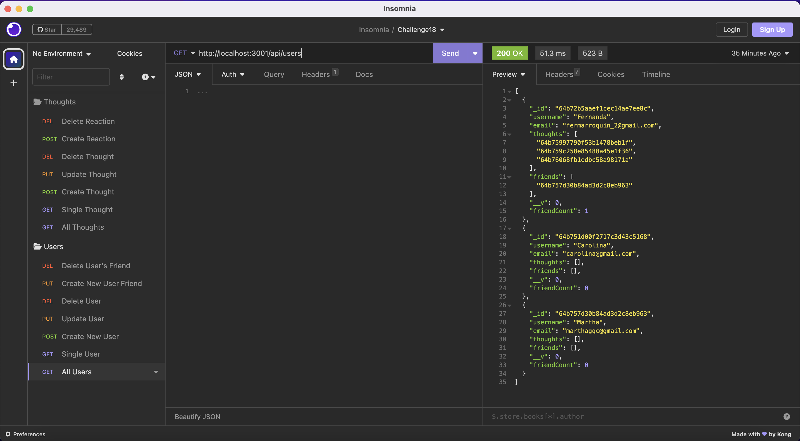

# 18 NoSQL: Social Network API

## Task

The challenge for this week was to build an API for social network web application where users can share thoughts and reactions and have a friends list. There was no starter code. 

Technologies used: Express.js for routing, MondoDB for database and the Mongoose ODM.

No seed data was provided, so data were created using Insomnia after the API was created. A walk-through video is shown later in this document. 

## Given User Story

```md
AS A social media startup
I WANT an API for my social network that uses a NoSQL database
SO THAT my website can handle large amounts of unstructured data
```

## Mock Up

The following video shows the functionality of various routes of the API. 

[](https://drive.google.com/file/d/15XSEJ-tBe6WqMrZGYqokYCoEBHVeLuj7/view?usp=sharing)

## GitHub Repository

Repo: https://github.com/MariaFernandaMarroquin/social-network-API

---
© 2023 edX Boot Camps LLC. Confidential and Proprietary. All Rights Reserved. Developed by María Fernanda Marroquín. 